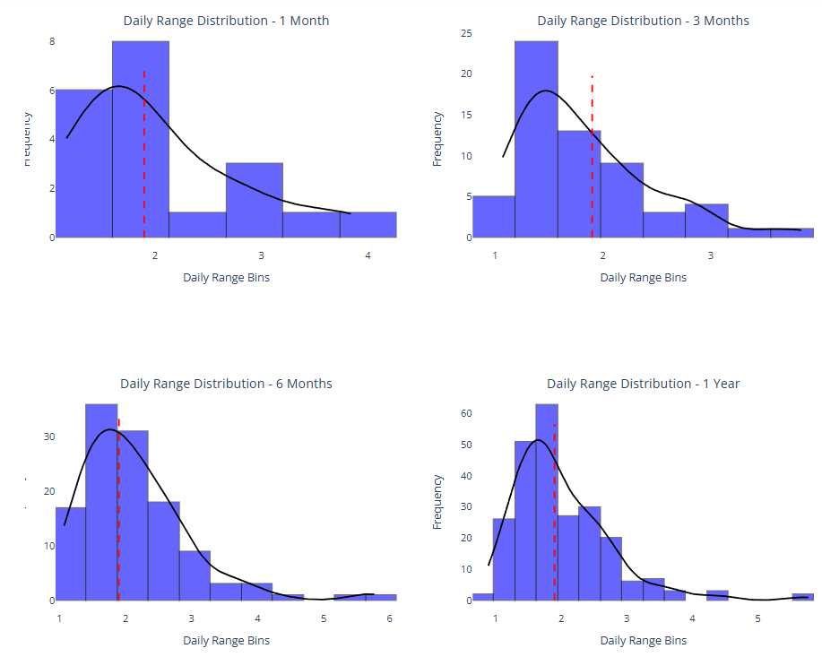
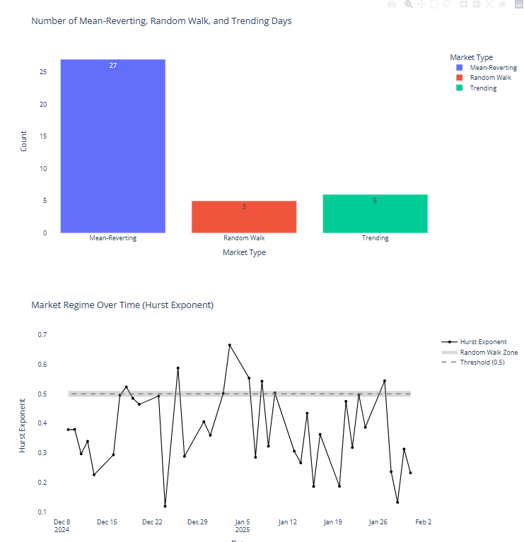
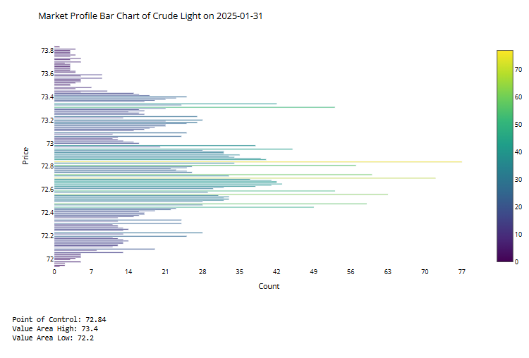
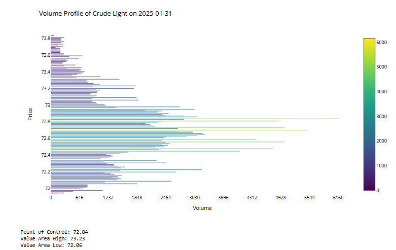

# Quantitative Analysis on Futures

This project offers a comprehensive quantitative analysis of crude oil, leveraging statistical tools, market regime detection and market structure evaluation to enhane trading decisions. 

**Volatility Analysis**

Presents 1-month, 3 month,  month and 12 month distribution curves of daily volatility, providing context for how the latest price action aligns with historical patterms. 

**Market Regime Detection**

Applies the **Hurst Exponent** to assess recent market behavior, distinguishing between mean-reverting and trending periods to guide traders to use the appropriate strategies. 

**Market Profile & Volume Profit Insights**

Analyzes key **price levels, Points of Control (PoC) and Value Areas** to determine what the market perceived as *fair value* in prior trading sessions. 

Through these quantitative methods, the porject delivers **actionable insights** into any tradeable instrument that supports speculators in making **data-backed decisions** that align with current market dynamics. 

